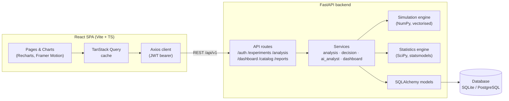
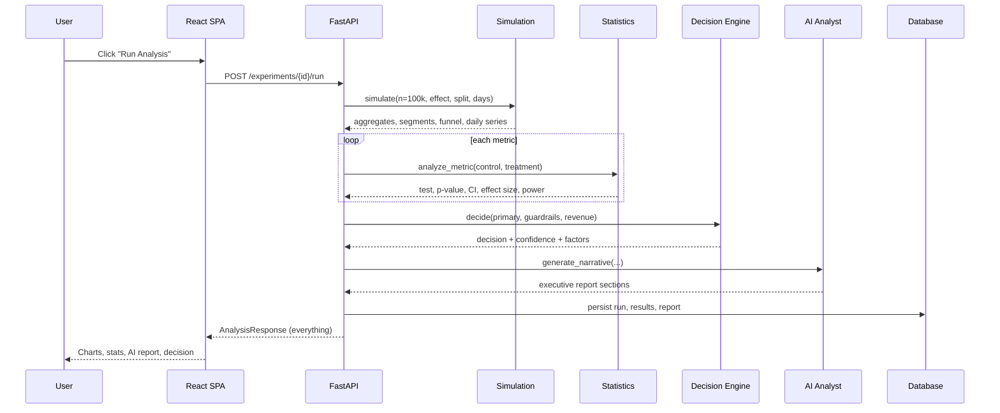
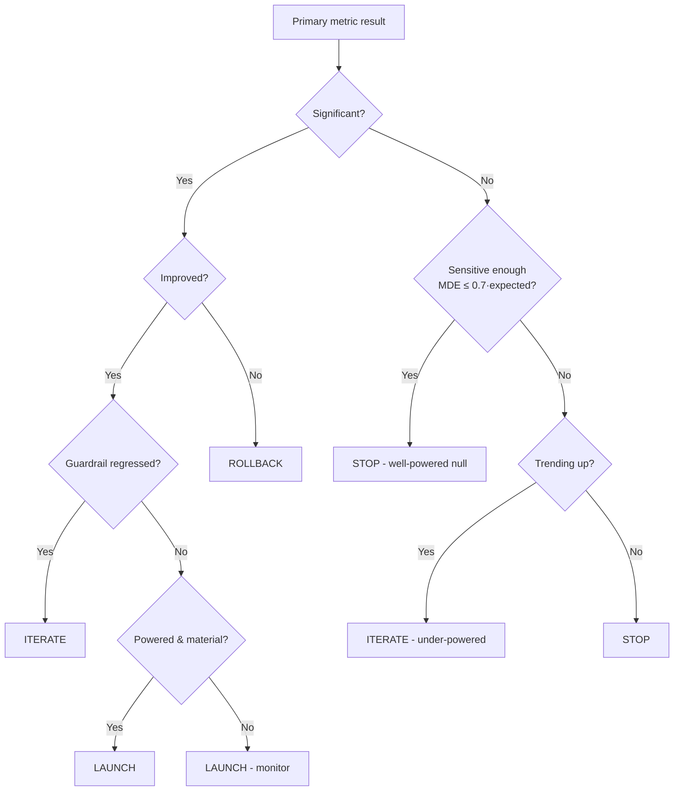

# Architecture

ExperimentOS is a two-tier application: a **React SPA** talking to a **FastAPI** backend over a versioned REST API, with all analytics computed server-side in Python.

## System overview

## Experiment run — sequence

## Layered backend design

| Layer | Responsibility | Key modules |
|---|---|---|
| **API** | HTTP, auth, validation, serialization | `api/routes/*`, `api/deps.py` |
| **Schemas** | Typed request/response contracts (Pydantic) | `schemas/*` |
| **Services** | Orchestration & business logic | `services/analysis_service.py`, `decision_engine.py`, `ai_analyst.py`, `dashboard_service.py` |
| **Analytics** | Pure, testable computation | `simulation/*`, `statistics/*` |
| **Models** | Persistence (SQLAlchemy 2.0 typed) | `models/*` |
| **Core** | Config + security | `core/config.py`, `core/security.py` |

Separation of concerns is strict: the statistics and simulation packages have **no** knowledge of the web framework or the database — they take numbers in and return numbers out, so they're trivially unit-testable.

## The simulation engine

`simulation/engine.py` is fully vectorised with NumPy:

1. **Population** — draw segment labels (device, user type, membership, city, age) from a realistic mix.
2. **Latent propensities** — combine per-segment multipliers into per-user levers (convert, click, checkout, aov, bounce, repeat, retain, coupon, session, delivery, rating, engagement).
3. **Treatment effect** — apply the treatment's *true* effect to the levers the primary metric drives, with **mean-normalised, per-user heterogeneity** so different cohorts respond differently. Secondary levers move too, so correlated metrics stay coherent.
4. **Sampling** — draw observed events from the propensities (Bernoulli for rates, Gamma for AOV/session, Normal for delivery/rating, Poisson for counts). This is where the realistic randomness enters.
5. **Aggregation** — compute per-variant × per-metric aggregates, per-segment slices, a daily time-series, a conversion funnel and distribution histograms.

> **Design choice:** raw per-user rows are generated in memory and discarded; only aggregates are persisted. This is exactly how production experimentation platforms behave (raw events live in a warehouse; the app stores pre-aggregated results).

## The statistics engine

`statistics/engine.py::analyze_metric` picks the correct test from the metric type and returns a self-describing `MetricAnalysis`:

- **proportion** → `two_proportion_z_test` (pooled SE for the statistic, unpooled SE for the CI)
- **mean** → `two_sample_t_test` (Welch's, with Welch–Satterthwaite df)
- effect size (Cohen's *h* / *d*), achieved power, MDE, required sample size, and a plain-English explanation with guardrail warnings.

## The decision engine

`services/decision_engine.py` maps evidence → one of five decisions:

A 0–100 **confidence score** blends p-value strength, power and effect size, with a penalty for guardrail regressions. **Projected annual revenue** extrapolates the ARPU delta to 100% traffic over 12 months.

## The AI analyst

`services/ai_analyst.py` is **data-driven and deterministic by default** — every sentence derives from the actual statistics, so it never invents numbers. Sections: summary, why-it-happened, business impact, revenue, biases, confounders, risk, recommendation, next experiments, and PM-interview observations. If `ANTHROPIC_API_KEY` is set, the same structured evidence is handed to Claude to polish the prose; otherwise the built-in analyst voice is used.

## Frontend architecture

- **Data layer** — `services/endpoints.ts` (typed axios) + `hooks/queries.ts` (TanStack Query) give cache, background refetch and optimistic invalidation.
- **Design system** — hand-built shadcn-style primitives in `components/ui/` (no heavy Radix dependency), a dark-enterprise theme via CSS variables, and a **colour-blind-validated** chart palette (`lib/decisions.ts`).
- **Charts** — `components/charts/` wrap Recharts with a shared tooltip/legend and secondary encoding (control = dashed neutral, treatment = solid indigo) so identity never relies on colour alone.
- **Resilience** — an `ErrorBoundary` isolates render errors; a 401 interceptor clears the session.
