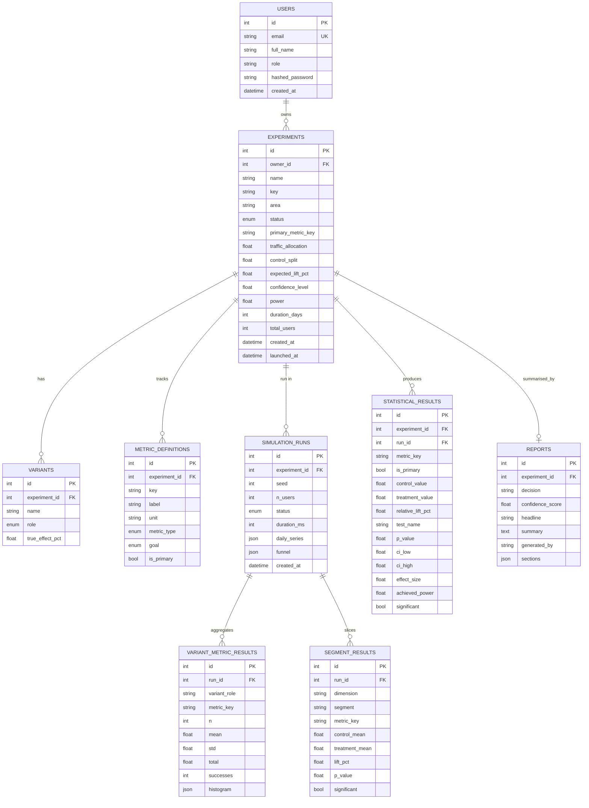

# Database

Normalised relational schema managed by SQLAlchemy 2.0. Runs on **SQLite** out of the box and on **PostgreSQL** by pointing `DATABASE_URL` at Postgres — the models are identical.

## ER diagram

## Table reference

| Table | Purpose | Notable columns |
|---|---|---|
| `users` | Account that owns experiments | `email` (unique), `hashed_password` (pbkdf2_sha256) |
| `experiments` | The central design entity | `status` (draft/running/completed/archived), `primary_metric_key`, design params (`confidence_level`, `power`, `control_split`…) |
| `variants` | Control & treatment arms | `role` (control/treatment), `true_effect_pct` (ground truth the simulator applies) |
| `metric_definitions` | Metrics tracked by an experiment | `metric_type` (proportion/mean), `goal` (increase/decrease), `is_primary` |
| `simulation_runs` | One execution of the pipeline | `seed`, `n_users`, `daily_series` (JSON), `funnel` (JSON) |
| `variant_metric_results` | Aggregated per (variant, metric) | `n`, `mean`, `std`, `successes`, `histogram` (JSON) |
| `segment_results` | Per-segment slice of the primary metric | `dimension`, `segment`, `lift_pct`, `p_value`, `significant` |
| `statistical_results` | Test output per metric | `test_name`, `p_value`, `ci_low/high`, `effect_size`, `achieved_power` |
| `reports` | Executive analysis + decision | `decision`, `confidence_score`, `sections` (JSON narrative + factors) |

## Design notes

- **Aggregates, not raw events.** A run generates 100k+ synthetic users in memory; only aggregates (`variant_metric_results`, `segment_results`) and the run metadata are persisted. Storing raw rows would bloat the DB and mirror no real platform.
- **JSON columns** (`daily_series`, `funnel`, `histogram`, `sections`) hold flexible nested payloads that are read as a unit and never queried by their internals — a good fit for JSON on both SQLite and Postgres.
- **Cascades.** Deleting an experiment cascades to its variants, metrics, runs (and their child aggregates), statistical results and report.
- **Idempotent re-runs.** Re-running an experiment clears the previous run's artefacts first, so results never accumulate stale rows.
